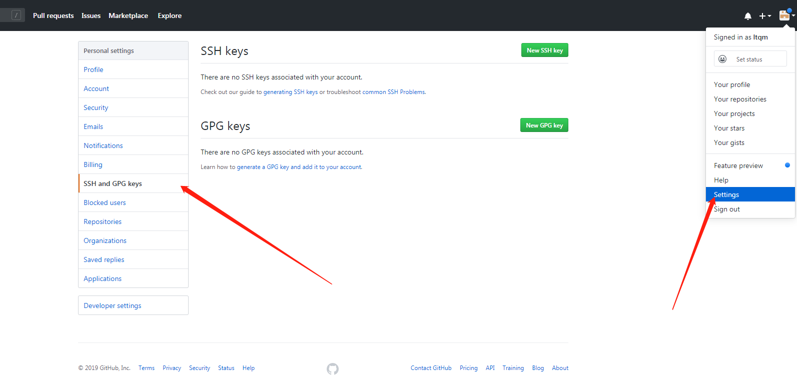

:::tip
Git是一个 “分布式版本管理工具”，简单的理解版本管理工具：大家在写东西的时候都用过 “回撤” 这个功能，但是回撤只能回撤几步，假如想要找回我三天之前的修改，光用 “回撤” 是找不回来的。而 “版本管理工具” 能记录每次的修改，只要提交到版本仓库，你就可以找到之前任何时刻的状态（文本状态）。
::: 

<!-- more -->

## 安装配置

### 初始配置
配置文件为 ~/.gitconfig ，执行任何Git配置命令后文件将自动创建。

第一个要配置的是你个人的用户名称和电子邮件地址。这两条配置很重要，每次 Git 提交时都会引用这两条信息，说明是谁提交了更新，所以会随更新内容一起被永久纳入历史记录：
``` bash
git config --global user.email "18059040043@139.com"
git config --global user.name "18059040043@139.com"
```

### 常用命令

1. 初始化新仓库 git init
2. 克隆旧仓库 git clone https://github.com/xxxx/xxx.git
3. 查看状态 git status
4. 提交单个文件 git add index.html
5. 提交所有文件 git add .
6. 使用通配符提交 git add *.js
7. 提交到仓库中 git commit -m '提示信息'
8. 删除版本库与项目目录中的文件 git rm index.php
9. 拉取origin主机的xxx分支与当前分支合并 git pull origin xxx
10. 推送到远程主机的xxx分支 git push origin xxx


### .gitignore

.gitignore用于定义忽略提交的文件
- 所有空行或者以注释符号 ＃ 开头的行都会被 Git 忽略
- 匹配模式最后跟反斜杠（/）说明要忽略的是目录。

``` javascript
.idea
/vendor
.env
/node_modules
/public/storage
*.txt
```

### Branch

分支功能主要用于增加新功能与处理BUG时使用，便于管理
1. 创建分支 git branch develop
2. 查看分支 git branch
3. 切换分支 git checkout develop
4. 创建并切换分支 git checkout -b develop
5. 合并分支 develop 到 master 
```
git checkout master
git merge develop

```
6. 删除分支 git branch -d develop
7. 删除没有合并的分支 git branch -D develop
8. 删除远程分支 git push origin :devlop
9. 查看未合并的分支(切换到master) git branch --no-merged
10. 查看已经合并的分支(切换到master) git branch --merged

### 冲突解决

协同开发是多个开发人员同时更改同一分支文件都可能造成冲突,造成无法提交代码。

1. 使用编辑器解决冲突文件
2. 添加暂存 git add . 表示解决冲突
3. git commit '解决冲突'  提交完成

## 远程仓库

### SSH

**生成秘钥**
使用ssh连接Github发送指令更加安全可靠，也可以免掉每次输入密码的困扰。
在命令行中输入以下代码（windows用户使用 Git Bash）
```
ssh-keygen -t rsa
```
一直按回车键直到结束。系统会在~/.ssh 目录中生成 id_rsa和id_rsa.pub，即密钥id_rsa和公钥id_rsa.pub

**向github添加秘钥**



点击 New SSH key 按钮，添加上面生成的 id_rsa.pub 公钥内容。

### 关联远程

1. 创建本地库并完成初始化
```
echo "# hd-xj" >> README.md
git init
git add README.md
git commit -m "first commit"
```
2. 添加远程仓库
```
git remote add origin https://github.com/ltqm/Admin.git
```
3. 查看远程残酷
```
 git remote -v
```
4. 拉取远程数据
```
git pull origin develop
```
5. 推送数据到远程仓库
```
git push origin develop
```
6. 删除远程仓库关联
```
git remote rm origin
```

> 通过clone的仓库,本地与远程都已经关联上,以上步骤可以省略

### Pull 

拉取远程主机某个分支的更新，再与本地的指定分支合并。
1. 拉取origin主机的develop分支与当前分支合并 git pull origin develop
> 如果存在冲突 处理网冲突后提交
2. 如果远程分支与当前本地分支同名直接执行 git pull

### Push

git push命令用于将本地分支的更新，推送到远程主机。它的格式与git pull命令相似
1. 将当前分支推送到origin主机的对应分支(如果当前分支只有一个追踪分支 ，可省略主机名)
```
git push origin
```
2. 使用-u选项指定一个默认主机 ,这样以后就可以不加任何参数直播使用git push。
```
git push -u origin master
``` 
3. 删除远程develop分支 git push origin --delete develop
````
git push origin --delete develop
```


### Clone
```
<--克隆默认分支-->
git clone  https://github.com/ltqm/Admin.git
<--克隆指定分支-->
git clone -b develop  https://github.com/ltqm/Admin.git
```


